# Amazon Location Coupon Data Analysis Report
Using survey data from Amazon Mechanical Turk, this analysis provide insight into what type of customer under what circumstances are more likely to accept certain type of coupons

## Data Description
Data collected on location coupons offered to drivers and whether coupons were accpted

### User attributes
-  Gender: male, female
-  Age: below 21, 21 to 25, 26 to 30, etc.
-  Marital Status: single, married partner, unmarried partner, or widowed
-  Number of children: 0, 1, or more than 1
-  Education: high school, bachelors degree, associates degree, or graduate degree
-  Occupation: architecture & engineering, business & financial, etc.
-  Annual income: less than \$12500, \$12500 - \$24999, \$25000 - \$37499, etc.
-  Number of times that he/she goes to a bar: 0, less than 1, 1 to 3, 4 to 8 or greater than 8
-  Number of times that he/she buys takeaway food: 0, less than 1, 1 to 3, 4 to 8 or greater
than 8
-  Number of times that he/she goes to a coffee house: 0, less than 1, 1 to 3, 4 to 8 or
greater than 8
-  Number of times that he/she eats at a restaurant with average expense less than \\$20 per
person: 0, less than 1, 1 to 3, 4 to 8 or greater than 8
-  Number of times that he/she eats at a restaurant with average expense between $20 to $50 per
person: 0, less than 1, 1 to 3, 4 to 8 or greater than 8

### Contextual attributes
- Driving destination: home, work, or no urgent destination
- Location of user, coupon and destination: we provide a map to show the geographical
location of the user, destination, and the venue, and we mark the distance between each
two places with time of driving. The user can see whether the venue is in the same
direction as the destination.
- Weather: sunny, rainy, or snowy
- Temperature: 30F, 55F, or 80F
- Time: 7AM, 10AM, 2PM, 6PM, or 10PM
- Passenger: alone, partner, kid(s), or friend(s)
- Type of car

### Coupon attributes
- Time before it expires: 2 hours or one day

### Result
- Coupon was accepted or rejected

## Data Set
- Number of records: 12,684
- Missing data
  - Type of car data missing for majority of the records
  - Frequency for going to bar, coffee house, restaurants and getting takeout are missing 1-2% of the records  

Data file: [coupons.csv](data/coupons.csv)

## Analysis
### Coupon Type Acceptance Rate
- Restaurant less than $20 and Take away are most likely to be accepted
- Bars and high-end restaurants are likely to be rejected
- Coffee house coupons are equally likely to be accepted or rejected

  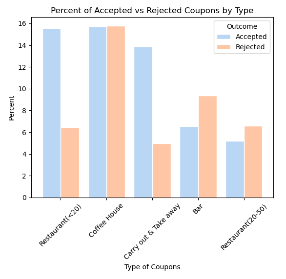

### Effect of Temperature on Coupon Acceptance
- More coupons are accepted when temperature is high
- Customers are more likely to accept coffee house and restaurant less than $20 when weather is hot
- Coupons for take away is most popular on cold days
    
  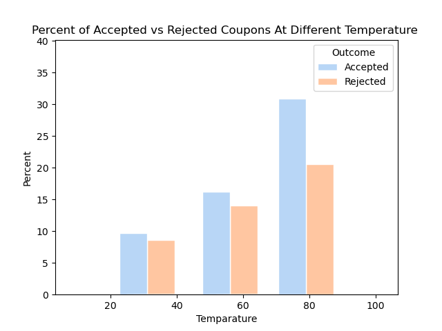

  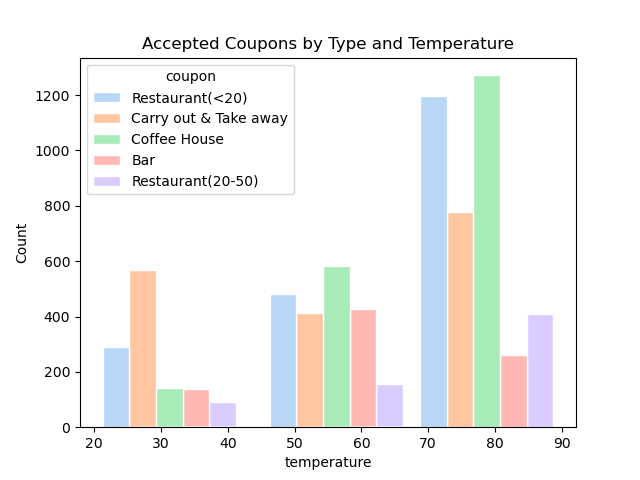

### Bar Coupon Acceptance Analysis
- Overall, 41% of Bar coupon were accepted
- Acceptance rate is 37% for customers who go to a bar 3 or fewer times a month vs 77% for those who go 4+ times
- Acceptance rate is 70% for customers who go to a bar more than once a month and are over 25 vs others 34%
- Acceptance rate is 71% for drivers who go to bars more than once a month and had passengers that were not a kid and had occupations other than farming, fishing, or forestry vs 30% for others
- Acceptance rate is 59% for these drivers in any of the listed conditions compared to 30% for other drivers

##### Overall acceptance rate for bar coupons
- Overall, 41% of Bar coupon were accepted
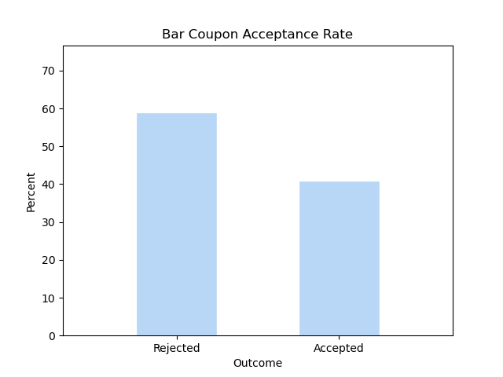

##### Frequent bar goers
- Acceptance rate is 37% for customers who go to a bar 3 or fewer times a month vs 77% for those who go 4+ times 

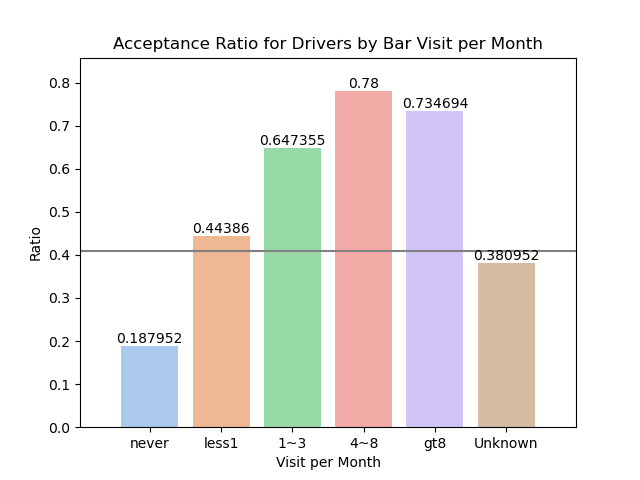

##### 25+ years old who visits bar more than once a month
- Acceptance rate is 70% for customers who go to a bar more than once a month and are over 25 vs others 34%
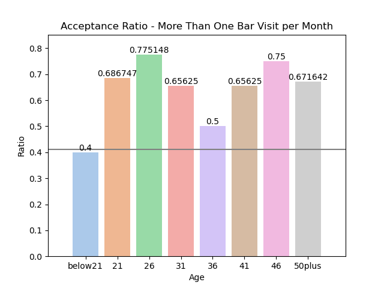

##### Drivers who go to bars more than once a month and had passengers that were not a kid and had occupations other than farming, fishing, or forestry
- Acceptance rate is 71% for drivers who go to bars more than once a month and had passengers that were not a kid and had occupations other than farming, fishing, or forestry vs 30% for others
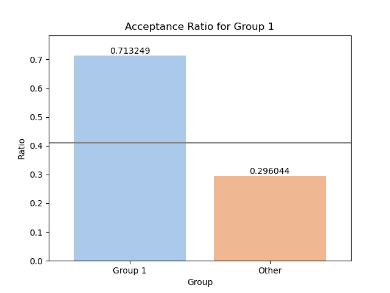

##### Drivers in specific conditions
Drivers who:
- Go to bars more than once a month, had passengers that were not a kid, and were not widowed *OR*
- Go to bars more than once a month and are under the age of 30 *OR*
- Go to cheap restaurants more than 4 times a month and income is less than 50K.

###### Acceptance rate is 59% for these drivers compared to 30% for other drivers
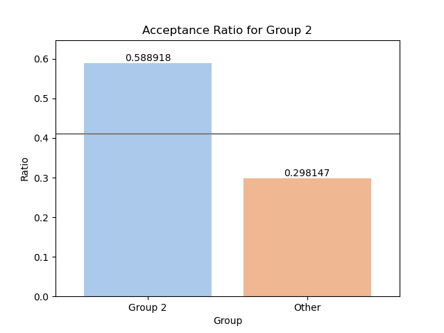

#### Hypothesis on drivers who accepted bar coupons
Using the overall 41% of acceptance rate for bar coupons as benchmark, any groups that have significant acceptance rate above 41% are more likely to accept the coupons.

Bar visit frequency is a strongly correlated with coupon acceptance
- Drivers that goes to bars more than once a month have much higher acceptance rate than benchmark
- The higher frequency of bar visit, the more likely are coupons accepted

Other factors that has minor positive impact on acceptance rate:
- Not having kids as passengers
- Age between 21 and 30
- Single people or married without kids as passengers
- Frequently dine in cheap restaurants and income under 50k

### Coffee House Coupon Acceptance Analysis
- Overall, 50% of Coffee House coupon were accepted
- Coffee house location matters. The closer the coffee house is to the driver, the more likely the coupon is accepted
- Drivers are slightly more likely to accept coupons for farther location if:
  - they are not going to work
  - coffee houses is in the same direction as where they are going
- Acceptance rate is 51% for customers who go to a coffee house more than once a month and are over 25 vs others 49%

##### Overall acceptance rate for coffee house coupons
- Drivers are just as likely to accept coffee house coupons as they are to reject them
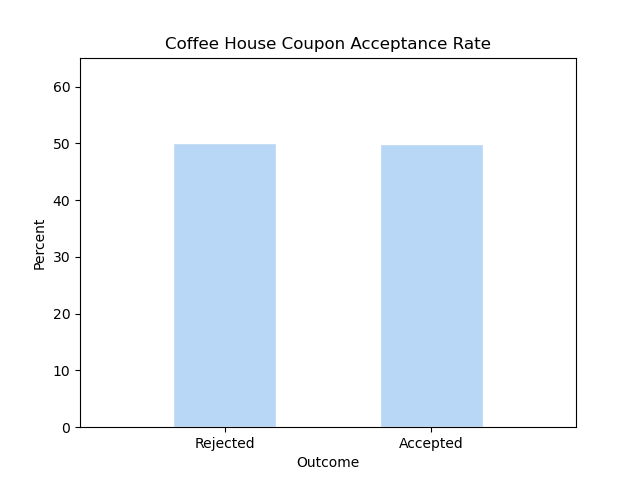

##### Coffee house coupons by distance to the driver
- Coffee house location matters. The closer the coffee house is to the driver, the more likely the coupon is accepted

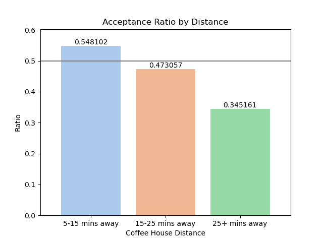

##### Drivers willing to go to a coffee house farther away¶
- Drivers are slightly more likely to accept coupons for farther location if:
  - they are not going to work
  - coffee houses is in the same direction as where they are going

Comparison of those in this cohort and others:
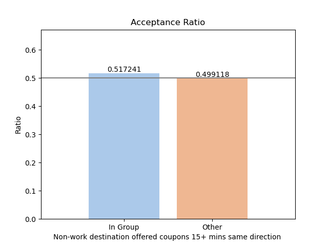

##### Coffee house coupons by time of day
- Coupons offered in the evening or at night have low acceptance rate

| Time | Coupon Acceptance Rate |
  | :----- | ----------- |
  | 7 am | 45% |
  | 10 am | 64% |
  | 2 pm | 55% |
  | 6 pm | 41% |
  | 10 pm | 42% |
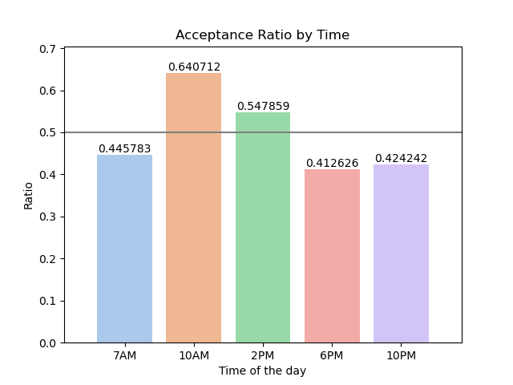

##### What can increase accept evening and late night coupons?
 - Coupon acceptance increases to 71% for users who goes to coffee houses more than once a month and if coupon expiry is 1 day instead of 2 hours

Compared to 48% acceptance for coupons offered not under the same condition
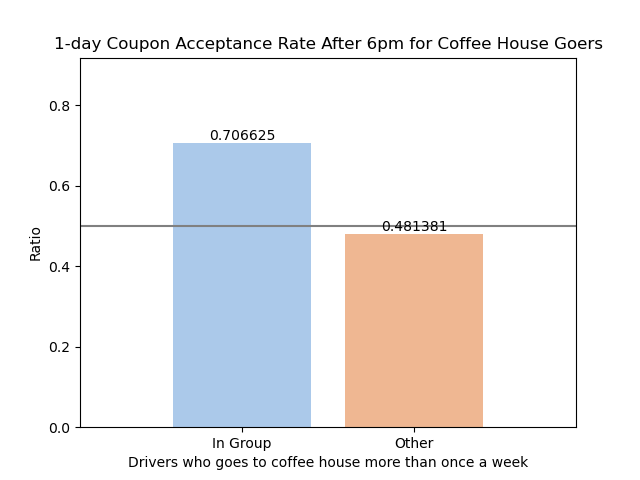

#### Hypothesis on drivers who accepted coffee house coupons
- Coffee house coupons are not as popular as restaurant and take away coupons
- Distance to the coffee house is a influential factor in acceptance rate
  - 55% for coffee houses within 5-15 minutes
  - 47% for coffee houses 15-25 minutes away
  - 35% for coffee houses 25+ minutes away
- Small increase in acceptance rate for farther coffee houses if:
  - they are not going to work
  - coffee houses is in the same direction as where they are going
  - Drivers don't want to go out of their way to get to a coffee house
- Coupons offered in the evening or at night have low acceptance rate
  - Acceptance increases to 71% for users who go to coffee houses more than once a month and if coupon expiry is 1 day instead of 2 hours compared to 48% acceptance for coupons offered not under the same condition
  - Evening and late night coupons are more likely to be accepted if they are offered for longer duration
  - This could be due to the fact that people are more likely to go to coffee houses in the evening and late night for socializing and relaxation
  
